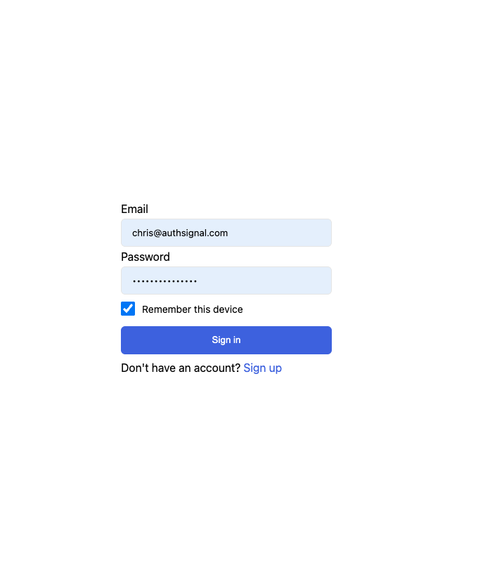
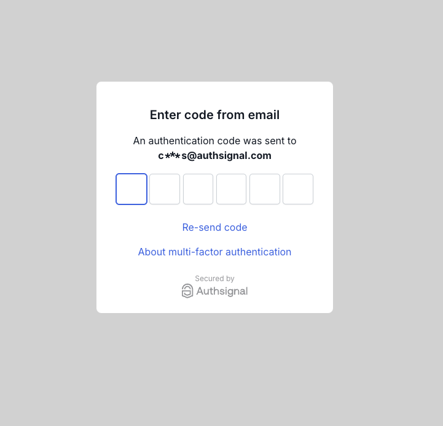

# Authsignal + Cognito Amplify Example

## Example app

This web app demonstrates how to implement "remember this device" functionality.

<p float="left">


</p>

## Configuration

Set these vars in your `.env` file.

```
VITE_AUTHSIGNAL_TENANT_ID=
VITE_AUTHSIGNAL_URL=
VITE_USER_POOL_ID=
VITE_USER_POOL_CLIENT_ID=
```

## Installation

```
yarn install
```

## Run

```
yarn dev
```
